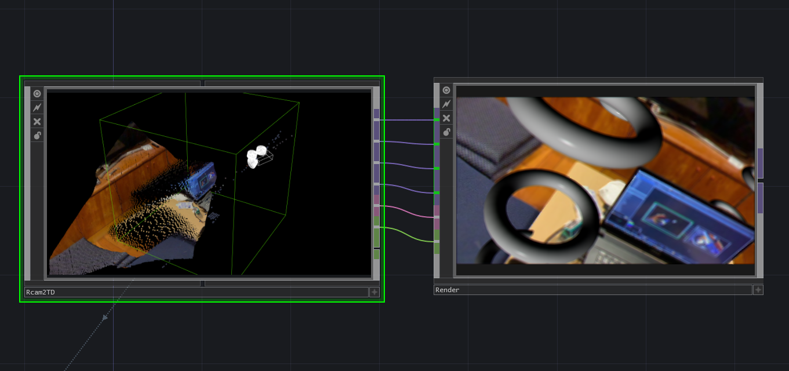

# TD-Rcam2TD

Receive @keijiro's [Rcam2](https://github.com/keijiro/Rcam2) (part of RcamController) data in TouchDesigner via NDI.

You can use this component to receive:
- Camera pose and camera matrix
- Depth data and point cloud data
- Human body segmentation mask
- Values of buttons and knobs